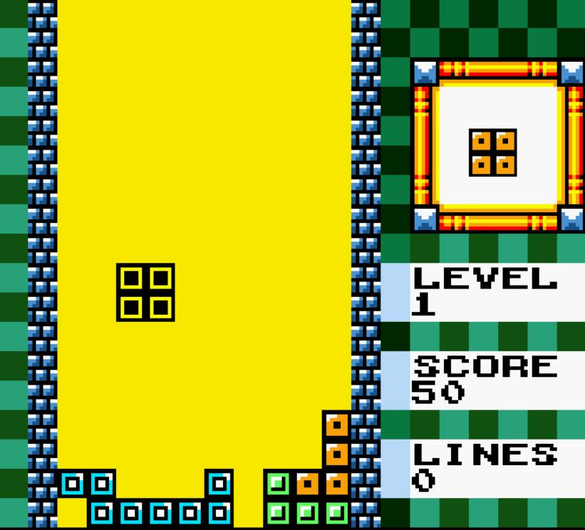

## RetroPyTetris

RetroPyTetris is a classic Tetris clone made entirely in Python and PyGame. It was one of my earlier projects, written before I learned how to organize code into files and folders, but it still plays a fully functional game of Tetris you can enjoy or hack on!

## 🎮 Features

- Classic falling-block puzzle gameplay
- Simple keyboard controls (see below)
- Colorful retro graphics using
- All code in one place—easy to explore for beginners

## 🕹️ Controls

- **Left/Right Arrow:** Move block left/right
- **Up Arrow:** Rotate block
- **Down Arrow:** Speed up block
- **Mouse Click:** Pause game

## 📝 How to Run

1. Make sure you have Python 3 installed.
2. Install any dependencies (listed in `requirements.txt` or in the code):

```
pip install -r requirements.txt
```
Or manually:
```
pip install pygame
```
## 📦 Project Structure

All code is in a single file for this project—just open and run `TetrisSimple.py`.

## 🖼️ Screenshot



## 💡 Notes

- This project is not modular—but it’s easy to follow and change for beginners.
- Contributions, suggestions, and refactoring ideas are welcome!

## 📜 License

This project is licensed under the MIT License.
